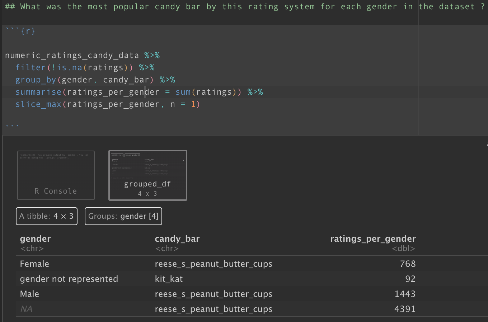

# Dirty Data Project

# Description

The aim of this project was to extract meaningful insights from 3 untidy raw datasets of halloween candy data and 2 untidy data sets of decathlong data. To do this I had to clean it to a _tidy_ format using a variety of packages and functions (listed below). Once cleaned, I was set tasks to solve using the clean data in the most efficient way possible.

# Technologies Used

All cleaning was done within an __R-script__ using mainly _tidyverse_ functions. Data wrangling and analysis was complete in __R-Studio__ to ensure all analysis and interpretation could be completed simultaneously.

# Packages Used

* dplyr
* tidyverse
* janitor
* stringr
* tibble
* magrittr
* readXL
* here

# Task 1 - Decathlon Data

The first task was completed using a raw data set derived from two separate decathlon competitions: an Olympic competition and the World Championships. the cleaning process was as follows:

* Used `clean_names()` in janitor package to have consistent column name formatting
* Used tibble to change our rownames, athlete names, into a column
* Utilised pivot_longer to organise the data in a format more accessible for later analysis
* Finally, to rename column names so they were more easily understood and the code would be reproducible & replicable. 

# Task 4 - Halloween Data

The next task was done using three years of raw halloween candy data collected by survey participants while they potentially went trick-or-treating. This data was particularly dirty in terms of the columns and observations within the data. In general, my cleaning process followed the steps below:

* Remove unneccesary columns from each data set that was not pertinent to candy data
* Rename columns to enhance reproducibility & replicability and shorten cumbersome column names
* Change age to a numeric column and add upper & lower limits to ensure erroneous entries are discarded
* Utilise mutate and case_when to clean ratings and gender columns so they had consistent wording
* Compare column names and bind_rows on the 3 data sets to create 1 combined data set
* pivot_longer our new 1 data set
* Create regex patterns and use str_detect to clean country column (the trickiest part!)

# Code Examples

Example of case_when() to recode categorical variables to numerical rating in order to summarise numerically the highest rated candy in following questions:

Example of regex pattern and str_detect to capture as many of the country entries as possible:

Example of using several tidyverse verbs together to aggregate a large subset of data into one measurable metric that will return the highest rated candy by gender:

